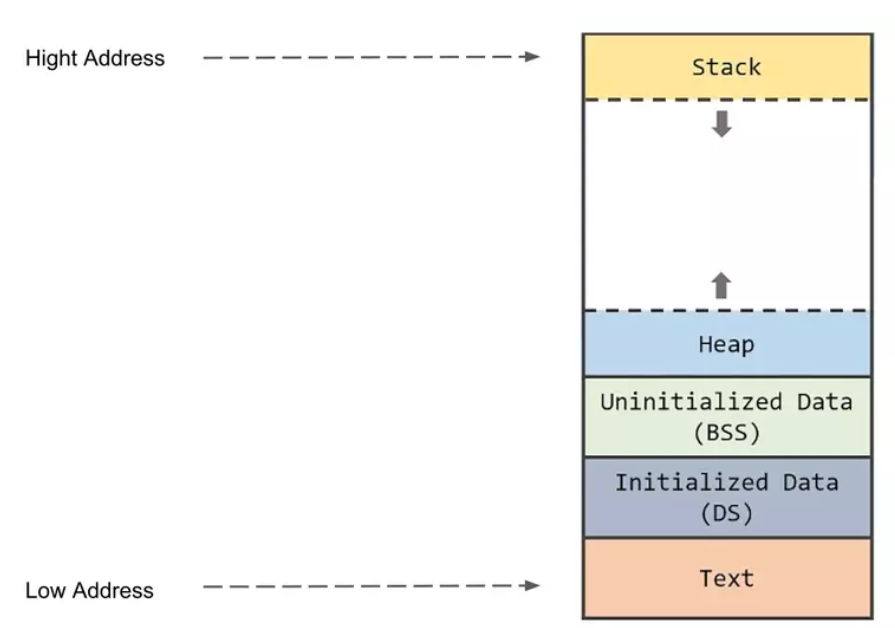

# Memory layout of a C program

## Text Segment
- Contain executable intructions
- Often read-only 

## Initialized data segment (DS)
- Contain the global variables and static variables that are initialized by the programmer (not zero) 

## Uninitialized data segment (BSS)
- Contain the global variables and static variables that are initialized to zero or do not have explicit initialization in source code.

## Heap 
- Heap is where dynamic memory allocation takes place
- Managed by malloc, realloc & free

## Stack
- Contain the program stack: function stack, local variables, ...etc
- LIFO structure
- When the stack pointer met the heap pointer, free memory was exhausted
- Store automatic variables, along with infomation that is saved each time a function is called.

